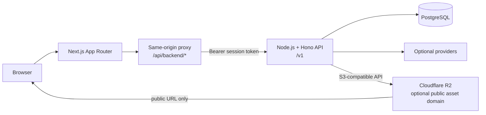

# Next.js and Hono SaaS architecture

Use this blueprint for a two-application modular monolith: one Next.js dashboard and one Node.js Hono API in a pnpm workspace. Keep PostgreSQL and external integrations behind the API. Do not introduce queues, microservices, or extra repositories until a measured requirement needs them.

## Contents

- [System boundaries](#system-boundaries)
- [Workspace](#workspace)
- [Frontend](#frontend)
- [Backend](#backend)
- [PostgreSQL and Drizzle](#postgresql-and-drizzle)
- [Cloudflare R2](#cloudflare-r2)
- [Security baseline](#security-baseline)
- [Testing boundary](#testing-boundary)
- [Deployment baseline](#deployment-baseline)

## System boundaries



The browser never receives PostgreSQL, R2, provider, or bearer-token credentials. For authenticated flows, the Next.js proxy reads an HttpOnly session cookie and forwards the token to Hono. Hono remains the authorization source of truth.

Use a neutral, project-specific cookie name stored in one server-only constant or environment setting. Do not reuse names from the source project.

## Workspace

```text
project/
  client/
  server/
  package.json
  pnpm-workspace.yaml
  pnpm-lock.yaml
```

Keep one lockfile at the root. Use the root manifest only for workspace metadata, convenience scripts, and shared tool policy; keep runtime dependencies in the application that imports them.

Use Node.js for both applications. Run Hono with `@hono/node-server`; do not depend on Bun runtime APIs or Bun test tooling.

Keep one root Prettier configuration for repository-wide formatting. Expose `format` and `format:check` from the root manifest, exclude generated output and the workspace lockfile, and run `pnpm format` after scaffolding is complete.

Merge the approved client, server, and quality conventions below into the existing root `AGENTS.md` for future code generation. Never overwrite existing repository instructions; propose the additions and wait for approval before merging them.

## Frontend

### Shape

```text
client/
  app/
    api/backend/[...path]/route.ts  # authenticated server-side proxy
    (dashboard)/<route>/page.tsx    # composes a feature screen
    layout.tsx                      # providers and shell
  features/
    <feature>/
      components/                   # feature-only UI
      hooks/                        # state and orchestration
      service.ts                    # endpoint calls only
      model.ts                      # DTOs, inputs, pure mappers
      index.ts                      # optional public surface
  components/
    ui/                             # shared primitives only
  lib/
    api/client.ts                   # dashboardApi/publicApi and parsing
    api/types.ts                    # cross-feature transport types
    utils.ts
  locales/
    en/
    vi/
```

Use App Router pages as composition boundaries. A page may own transient visual state such as an open dialog or selected tab. Keep request orchestration and feature state in feature hooks, endpoint calls in feature services, and explicit request/response types in feature models.

Use shared components only after a second real consumer appears. Do not add a repository wrapper around `service.ts` until a second data source requires it.

### Client rules

- Prefer Server Components. Add `"use client"` only when a component needs browser APIs, event handlers, or client-side state.
- Keep App Router pages thin: compose feature screens and own only transient display state.
- Keep feature-specific components, hooks, services, and models together under `features/<feature>`.
- Route protected requests through the feature service and shared `dashboardApi`; do not call backend URLs directly from UI components.
- Define explicit request and response types at the feature boundary. Do not pass untyped transport JSON through components.
- Keep one-feature components local. Promote a component to `components/ui` only after a second real consumer exists.
- Treat client navigation and hidden UI as presentation only; Hono remains responsible for authorization.
- When `vercel-react-best-practices` is available, apply its relevant React and Next.js performance rules without overriding repository instructions or these boundaries.

### Request flow

```text
page/component
  -> feature hook
  -> feature service
  -> dashboardApi('/feature/...')
  -> /api/backend/feature/...
  -> Hono /v1/feature/...
```

Use `dashboardApi` for protected calls. Use `publicApi` only for explicitly public endpoints. Do not add `NEXT_PUBLIC_API_BASE_URL` to the baseline when every browser call is same-origin; add it only when a direct public API consumer exists.

Navigation may hide unavailable routes, but it is not authorization. Enforce ownership and roles in Hono.

## Backend

### Shape

```text
server/src/
  index.ts                           # Hono composition and Node server
  config/env.ts                      # validated environment access
  db/
    client.ts                        # shared Drizzle client
    schema.ts                        # schema source of truth
  integrations/                     # only selected external integrations
    r2/r2.ts
  lib/                               # errors, responses, pagination, logging
  middleware/                        # authentication and role guards
  modules/
    <feature>/
      model.ts                       # validation, DTOs, pure mapping
      service.ts                     # business rules and transactions
      controller.ts                  # Hono context to service call
      routes.ts                      # paths and middleware
      model.test.ts                  # non-trivial parsing branches
      service.test.ts                # observable business behavior
```

Do not create empty module layers for hypothetical domains. When a feature is added, preserve this flow:

```text
routes -> authentication/role middleware -> controller -> service -> Drizzle/integration
```

- Routes attach authentication and role middleware.
- Controllers parse HTTP context, invoke one service operation, and return the standard response envelope.
- Services enforce ownership and domain rules, own transactions, and call Drizzle or integrations.
- Models define validated input and returned DTOs.
- A global error handler maps known application errors to stable `{ success: false, error }` responses and hides internal details.

### Server rules

- Validate environment variables once at startup and validate every untrusted request at its HTTP boundary.
- Keep routes limited to paths and middleware composition; keep controllers limited to HTTP parsing and response mapping.
- Put business rules, authorization, ownership checks, transactions, and integration coordination in services.
- Access Drizzle and external integrations from services, not controllers or route handlers.
- Keep DTOs, validation schemas, and pure mappings in the owning module's `model.ts`; avoid shared types until there is a real cross-module consumer.
- Use the centralized response envelope, application errors, environment access, database client, and structured logger instead of feature-local replacements.
- Update the TypeScript schema, generated migration, and affected module contracts together. Use database constraints for invariants that must survive concurrent requests.
- Co-locate one focused Node-compatible test for non-trivial parsing or business behavior; do not duplicate pure controller delegation tests.

Expose `GET /v1/health`. Keep the returned payload minimal and avoid leaking environment or dependency details. Close the Node HTTP server gracefully on `SIGINT` and `SIGTERM`.

## PostgreSQL and Drizzle

Keep the shared client in `server/src/db/client.ts`, the schema in `server/src/db/schema.ts`, Drizzle Kit configuration in `server/drizzle.config.ts`, and generated SQL migrations in `server/drizzle/`.

For each schema change:

1. Update the TypeScript schema and affected module contracts together.
2. Generate a migration with the server `db:generate` script.
3. Inspect SQL and migration metadata.
4. Commit schema and generated migration together.
5. Apply the migration with the server `db:migrate` script before dependent application code receives traffic.

Do not use `db:push` for shared or production environments. Put transactions in the service that owns the invariant, and enforce concurrency-safe invariants with database constraints and indexes.

## Cloudflare R2

Do not add R2 unless the project needs object storage. When selected, access it only from the API through the S3-compatible SDK.

```text
feature service -> integrations/r2/r2.ts -> S3 client -> R2
feature service -> Drizzle record containing key and public URL
```

Keep SDK setup in one adapter. Let the feature service validate MIME type and size, choose keys, authorize access, persist metadata, and perform compensating deletion after a failed database write.

Use a public custom domain only for intentionally public assets. Do not expose write credentials or add browser-direct uploads without an explicit requirement.

## Security baseline

- Validate environment variables once at startup and expose typed configuration.
- Allow the exact dashboard origin in CORS; do not combine credentials with a wildcard origin.
- Set session cookies as HttpOnly, Secure in production, scoped appropriately, and SameSite according to the confirmed browser flow.
- Use Hono secure headers and validate unsafe request origins when cookie-authenticated endpoints require it.
- Limit request bodies at the route that accepts uploads or large payloads.
- Return structured errors without stack traces, secrets, SQL, or provider payloads.
- Apply authorization and ownership checks before database writes or storage calls.

## Testing boundary

Use Node-compatible test tooling already generated or selected for the server; do not add Bun tests. Co-locate focused tests with modules. Test validation only when it branches, and test services for ownership, state transitions, transactions, and integration-failure cleanup. Mock remote provider boundaries and use an isolated PostgreSQL database when the database behavior is part of the assertion.

Avoid controller tests that duplicate pure delegation. Keep the client verification focused on visible feature behavior and the proxy/authentication boundary.

## Deployment baseline

- Deploy the Next.js dashboard and Node.js Hono API independently.
- Use separate environment values, PostgreSQL databases, and R2 buckets per environment.
- Run migrations once per release before code that requires the schema receives traffic.
- Configure the deployed dashboard origin and internal API target explicitly.
- Add queues, workers, caches, or separate services only after a concrete workload requires them.
