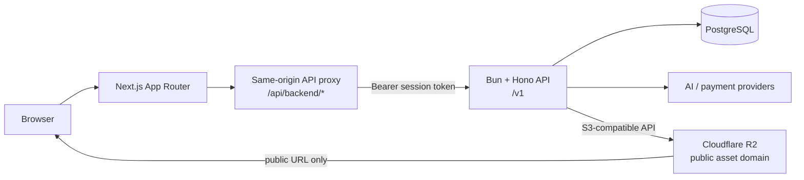

# SaaS Architecture

This blueprint follows the working structure of Content Writer Mint: a Next.js dashboard, a Bun/Hono API, PostgreSQL through Drizzle, and Cloudflare R2 for object storage. It is intentionally a modular monolith: one deployable frontend and one deployable API, without queues, microservices, or extra repositories until the product needs them.

## System boundaries



The browser never connects to PostgreSQL or R2 credentials directly. The Next.js proxy turns the HttpOnly session cookie into the API bearer token; Hono remains the authorization source of truth. The API persists database records and public R2 URLs, never provider-temporary URLs or cloud credentials.

## Frontend

### Responsibility split

Use App Router routes only as composition boundaries. A route renders a feature screen and may keep transient display state such as an open dialog or selected tab. It must not own API orchestration, long-lived feature state, or database-like models.

```text
client/
  app/
    api/backend/[...path]/route.ts  # authenticated server-side proxy
    (dashboard)/<route>/page.tsx    # composes one feature screen
    layout.tsx                      # providers and shell
  features/
    <feature>/
      components/                   # feature-only UI
      hooks/                        # use-*.ts: state and orchestration
      service.ts                    # endpoint calls only
      model.ts                      # feature DTOs, inputs, pure mappers
      index.ts                      # optional public feature surface
  components/
    ui/                             # shared primitives only
  lib/
    api/client.ts                   # dashboardApi, publicApi, response parsing
    api/types.ts                    # shared cross-feature API envelope/types
    utils.ts
  src/locales/
    en/ and vi/                     # page/feature translation catalogs when needed
```

The existing project already centralizes transport in `client/lib/api/client.ts`, API DTOs in `client/lib/api/types.ts`, and hooks in `client/lib/hooks/`. For a new SaaS, put new feature-specific hooks, service, model, and components under `features/<feature>` from the first feature. Keep `lib/api/client.ts`, the proxy, providers, and generic UI shared. Do not add a second repository layer around `service.ts` unless a real second data source appears.

### Request flow

```text
page/component
  -> useFeature hook
  -> feature service
  -> dashboardApi('/feature/...')
  -> /api/backend/feature/...
  -> Hono /v1/feature/...
```

`dashboardApi` is for authenticated dashboard requests. `publicApi` is only for explicitly public endpoints. The proxy at `app/api/backend/[...path]/route.ts` forwards the session token from the `content_writer_session` HttpOnly cookie and removes the token from the login response before returning it to the browser.

### Frontend rules

- Keep server DTOs and client request types explicit in `model.ts` or the shared API type file; do not treat raw JSON as a domain model in components.
- Hooks expose data, loading/error state, and actions. Services only make requests and map transport errors.
- Shared reusable controls belong in `components/ui`; a component used by one feature stays with that feature.
- Navigation may hide unavailable routes, but server authorization always decides access. Preserve the admin-management versus user-workspace boundary at both layers.
- Never place `DATABASE_URL`, R2 keys, provider secrets, or any server token in `NEXT_PUBLIC_*` variables.

## Backend

### Module shape

```text
server/src/
  index.ts                           # Hono composition, CORS, versioned route mounts
  config/env.ts                      # parsed environment access
  db/
    client.ts                        # shared Drizzle client
    schema.ts                        # relational schema and constraints
    migrate.ts                       # migration/bootstrap entry point
  integrations/
    r2/r2.ts                         # S3-compatible upload/delete adapter
  lib/                               # errors, responses, pagination, logging
  middleware/                        # authentication and role guards
  modules/
    <feature>/
      model.ts                       # DTOs, input parsing/validation, pure mapping
      service.ts                     # business rules, ownership, transactions
      controller.ts                  # HTTP request/context to service call
      routes.ts                      # endpoint paths and middleware
      service.test.ts                # business-flow tests
      model.test.ts                  # parser/validation tests when non-trivial
```

The current repository follows `model.ts`, `service.ts`, `controller.ts`, and `routes.ts` in every domain. Some features also contain a focused adapter such as `modules/images/storage.ts` or a provider client. For a starter project, promote an adapter to `integrations/` only when it is consumed by more than one feature; one `integrations/r2/r2.ts` is sufficient until R2 needs separate policies or clients.

### Backend request flow

```text
routes -> authentication/role middleware -> controller -> service -> Drizzle/integration
```

- Routes attach `requireAuth` and then `requireAdmin` or `requireUser` as appropriate.
- Controllers parse request input, call one service, and return the standard response envelope.
- Services enforce ownership and domain rules, own transactions, and call Drizzle or integrations.
- Models define validated inputs and returned DTOs; no route handler should duplicate validation logic.
- The global error handler converts known `ApiError` values into stable `{ success: false, error }` responses.

## PostgreSQL and Drizzle

Drizzle uses the `postgres` driver with one shared client in `server/src/db/client.ts`; `server/src/db/schema.ts` is the schema source of truth. `server/drizzle.config.ts` points Drizzle Kit at the schema and stores generated, committed SQL migrations in `server/drizzle/`.

Use this lifecycle for every schema change:

1. Change `src/db/schema.ts` and any affected module model/service contract together.
2. Run `bun run db:generate` from `server/` and inspect the generated SQL plus `drizzle/meta` changes.
3. Commit the schema and generated migration together.
4. Apply through `bun run db:migrate`; never use `db:push` as the production migration mechanism.

Database transactions belong in the service that owns the invariant, for example a payment confirmation that updates a transaction and credit balance together. Database constraints and indexes enforce invariants that must survive concurrent requests; service validation supplies readable API errors.

## Cloudflare R2 integration

Cloudflare R2 is accessed only by the API through its S3-compatible endpoint and `@aws-sdk/client-s3`.

```text
feature service -> integrations/r2/r2.ts -> S3Client -> Cloudflare R2
                                      -> { key, publicUrl }
feature service -> Drizzle record containing publicUrl and key when required
```

The R2 adapter accepts an explicit object key, bytes, and content type. It returns a key and URL built from the configured public domain. The feature service decides keys, validates content, and performs compensating deletion if a subsequent database transaction fails. This keeps storage policy near the feature while SDK configuration stays reusable.

Required server-only configuration:

```dotenv
R2_ACCOUNT_ID=
R2_ACCESS_KEY_ID=
R2_SECRET_ACCESS_KEY=
R2_BUCKET=
R2_PUBLIC_URL=https://assets.example.com
```

Use `region: 'auto'`, endpoint `https://<account-id>.r2.cloudflarestorage.com`, and path-style requests. `R2_PUBLIC_URL` is a public custom domain or allowed public delivery URL; it is not an S3 endpoint and does not grant write access.

## Testing boundary

Keep Bun tests alongside the module being tested. Test model parsing independently when it has branching rules, and test services for authorization/ownership, state transitions, transaction behavior, and integration failure cleanup. Mock provider and R2 SDK boundaries; run service tests against an isolated PostgreSQL database when database behavior is part of the assertion. Controllers do not need duplicated tests when their behavior is only delegation.

## Current-project notes

- The API is mounted under `/v1`; preserve that version prefix for external contracts.
- The current client development script serves port `3200`, while the Hono CORS default is `http://localhost:3000`. A new project must set `DASHBOARD_ORIGIN` to the actual frontend origin or deliberately align both ports.
- The current project keeps image R2 storage in `modules/images/storage.ts`. The `integrations/r2/r2.ts` shape above is the starter template, not a claim that the existing file has already moved.
